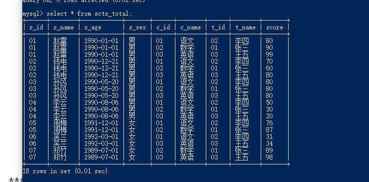

# 本文件中所写的是关于数据库中具体函数的用法：


#### drop、delete与truncate分别在什么场景之下使用？

##### drop table:

1)属于DDL					2)不可回滚
3)不可带where			4)表内容和结构删除
5)删除速度快

##### truncate table:

1)属于DDL					2)不可回滚
3)不可带where			4)表内容删除,结构还在
5)删除速度快

##### delete from:

1)属于DML				2)可回滚
3)可带where			4)表结构在，表内容要看where执行的情况
5)删除速度慢,需要逐行删除

##### 总结：

（1）不再需要一张表的时候，用drop
（2）想删除部分数据行时候，用delete，并且带上where子句
（3）保留表而删除所有数据的时候用truncate


##### 简单操作:

```mysql
mysql -uroot -p456321;
use tables;(具体名称)
show tables;
start transaction;
```


##### 排序order by:

```mysql
select c_id,score from score  order by c_id desc,score desc;
#可以对多个字段排序
#每个字段会要单独选择desc
#比如去掉第一个desc结果就会不同
```


## 关于count:

结论就是对于COUNT(1)和COUNT(*)执行优化器的优化是完全一样的，并没有COUNT(1)会比COUNT(*)快这个说法。

##### 条件统计：

（1）count() 函数中使用条件表达式加 or null 来实现，作用就是当条件不满足时，

​		函数变成了 count(null) 不会统计数量

```mysql
select count(num > 200 or null) from a;
```

（2）count() 函数中使用 if 表达式来实现，当条件满足是表达式的值为非空，条件不满足时表达式值为 NULL;

```mysql
select count(if(num > 200, 1, null)) from a;
```

（3）count() 函数中使用 case when 表达式来实现，当条件满足是表达式的结果为非空，

​			条件不满足时无结果默认为 NULL;

```mysql
select count(case when num > 200 then 1 end) from a;
```

select count(if(@rank=1, 1, null)) from book;


## 关于select:

##### 书写顺序： 

<select{[distinct |all] columns |*}>
[into table_name]
<from {tables |views | other select}>
[where conditions]
[group by columns]
[having conditions]
[order by columns]
[fetch first class]
[union < select query clause >]


##### 表别名：

SELECT column FROM table AS table_alias


##### 创建视图：

CREATE VIEW view_name AS
SELECT column_name(s)
FROM table_name
WHERE condition

```mysql
	create view scts_total as
     select st.s_id,st.s_name,st.s_age,st.s_sex,c.c_id,c.c_name,c.t_id,t.t_name,sc.score
    from student as st,course as c,teacher as t,score as sc
     where st.s_id=sc.s_id and sc.c_id=c.c_id and c.t_id=t.t_id;
```


##### 排他锁

select * from t for update 会等待行锁释放之后，返回查询结果。

select * from t for update nowait 不等待行锁释放，提示锁冲突，不返回结果

select * from t for update wait 5   等待5秒，若行锁仍未释放，则提示锁冲突，不返回结果

select * from t for update skip locked 查询返回查询结果，但忽略有行锁的记录 

select for update 是为了在查询时,避免其他用户以该表进行插入,修改或删除等操作,造成表的不一致性. 

但在查询之前要确保这个数据未被锁定才能加锁。

当我们进行for update的操作时，与普通select存在很大不同。一般select是不需要考虑数据是否被锁定，最多根据多版本一致读的特性读取之前的版本。加入for update之后，Oracle就要求启动一个新事务，尝试对数据进行加锁。如果当前已经被加锁，默认的行为必然是block等待。使用nowait子句的作用就是避免进行等待，当发现请求加锁资源被锁定未释放的时候，直接报错返回

那么，什么时候需要使用for update？就是那些需要业务层面数据独占时，可以考虑使用for update。场景上，比如火车票订票，在屏幕上显示有票，而真正进行出票时，需要重新确定一下这个数据没有被其他客户端修改。所以，在这个确认过程中，可以使用for update。这是统一的解决方案方案问题，需要前期有所准备。


##### 共享锁（share lock）

SELECT ... LOCK IN SHARE MODE;


##### 数据库的隔离级别相关：

 select @@transaction_isolation;

select @@global.transaction_isolation;

 select @@session.transaction_isolation; 

我们知道，可以分别用 @@global.transaction_isolation 和 @@ session.transaction_isolation来查看全局或会话级隔离级别，或者用 @@transaction_isolation 查看会话级隔离级别。也就是说： @@session.transaction_isolation 和 @@transaction_isolation 二者等价。

SET SESSION TRANSACTION ISOLATION LEVEL read uncommitted;详见数据库知识点的笔记

串行化(serializable)可重复读(repeatable_read)不可重复读（read-committed）

读未提交（read-uncommitted）


#### SQL 约束有哪几种？

NOT NULL: 用于控制字段的内容一定不能为空（NULL）。
UNIQUE: 控件字段内容不能重复，一个表允许有多个 Unique 约束。
PRIMARY KEY: 也是用于控件字段内容不能重复，但它在一个表只允许出现一个。
FOREIGN KEY: 用于预防破坏表之间连接的动作，也能防止非法数据插入外键列，因为它必须是它指向的那个表中的值之一。
CHECK: 用于控制字段的值范围。


## where子句和having子句：

（1）where子句     where自居仅仅用于从from子句中返回的值，from子句返回的每一行数据都会用where子句中的条件进行判断筛选。where子句中允许使用比较运算符（>,<,>=,<=,<>,!=|等）和逻辑运算符（and，or，not）。 

（2）having子句     having子句通常是与order by 子句一起使用的。因为having的作用是对使用group by进行分组统计后的结果进行进一步的筛选。

```
#重点！
1.where 不能放在GROUP BY 后面
2.HAVING 是跟GROUP BY 连在一起用的，放在GROUP BY 后面，此时的作用相当于WHERE
3.WHERE 后面的条件中不能有聚集函数，比如SUM(),AVG()等，而HAVING 可以
4.where是从from后面的表里找rak
```

（3）where和join到底使用哪一个？

结论：
         尽量使用Join 而不是Where来列出关联条件，特别是多个表联合的时候。
原因是：
            （1）在效率上，Where可能具有和Inner join一样的效率。但基本可以肯定的（通过SQLServer帮助和其它资料，以及本测试）是Join的效率不比Where差。
            （2）使用Join可以帮助检查语句中的无效或者误写的关联条件

​				(3)用where进行多表连接的比较时，先进行迪卡尔积，再过滤。而迪卡尔积是最费事的，会产生非常多的临时记录。 


### ---------

## 时间函数（date数据类型相关）：

1.datediff函数，返回值是相差的天数，不能定位到小时、分钟和秒。就是拿前一个的day减去后一个的day，

也不会四舍五入什么的。

```mysql
select datediff('2018-03-22 09:00:00', '2018-03-20 07:00:00');
#输出2

select datediff('2018-03-18 09:00:00', '2018-03-20 07:00:00');
#输出-2

select datediff('2018-03-22 01:00:00', '2018-03-20 07:00:00');
#输出2
```


2. TIMESTAMPDIFF函数，有参数设置，可以精确到天（DAY）、小时（HOUR），分钟（MINUTE）和秒（SECOND），使用起来比datediff函数更加灵活。对于比较的两个时间，时间小的放在前面，时间大的放在后面。

```mysql
select TIMESTAMPDIFF(DAY, '2015-03-20 23:59:00', '2015-03-22 00:00:00');
#输出1

select TIMESTAMPDIFF(DAY, '2015-03-20 00:00:00', '2015-03-22 00:00:00');
#输出2
```


3.当前日期

```mysql
SELECT NOW(),CURDATE(),CURTIME();
#+---------------------+------------+-----------+
#| NOW()               | CURDATE()  | CURTIME() |
#+---------------------+------------+-----------+
#| 2020-08-03 10:09:27 | 2020-08-03 | 10:09:27  |
```


## 数据库优化的思路（仅仅对于如何写sql语句）

(1）选择最有效的表名顺序

Oracle的解析器按照从右到左的顺序处理FROM子句中的表名，
因此FROM子句中写在最后的表(基础表 driving table)将被最先处理。
在FROM子句中包含多个表的情况下，你必须选择记录条数最少的表作为基础表。

当Oracle处理多个表时，会运用排序及合并的方式连接它们。
首先，扫描第一个表(FROM子句中最后的那个表)并对记录进行派序，
然后扫描第二个表(FROM子句中最后第二个表)，最后将所有从第二个表中检索出的记录与第一
个表中合适记录进行合并。
例如：
表TAB1 16，384 条记录
表TAB2 1条记录
选择TAB2作为基础表(最好的方法)
select count( * ) from tab1，tab2 执行时间0.96秒 
选择TAB2作为基础表(不佳的方法)　
select count( * ) from tab2，tab1 执行时间26.09秒 
如果有3个以上的表连接查询，那就需要选择交叉表(intersection table)作为基础表，
交叉表是指那个被其他表所引用的表。

也就是说：多表结合表之间有关时被其他表所引用的表放在最后，

多表结合表之间无关时将记录和列名最少的表，写在最后，然后依次类推


(2)where子句的连接顺序:

数据库采用自右而左的顺序解析WHERE子句,根据这个原理,表之间的连接必须写在其他WHERE条件之左,那些可以过滤掉最大数量记录的条件必须写在WHERE子句的之右。

```mysql
 select emp.empno,emp.ename,emp.sal,dept.dname
      from dept,emp
      where (emp.deptno = dept.deptno) and (emp.sal > 1500)
```


(3)SELECT子句中避免使用*号

我们当时学习的时候，“ * ”号是可以获取表中全部的字段数据的。
但是它要通过查询数据字典完成的，这意味着将耗费更多的时间
使用*号写出来的SQL语句也不够直观。


(4)用TRUNCATE替代DELETE

这里仅仅是：删除表的全部记录，除了表结构才这样做。
DELETE是一条一条记录的删除，而Truncate是将整个表删除，保留表结构，这样比DELETE快

但delete可以回滚

(5)多使用内部函数提高SQL效率

例如使用mysql的concat()函数会比使用||来进行拼接快，因为concat()函数已经被mysql优化过了。


(6)用表或列的别名
如果表或列的名称太长了，使用一些简短的别名也能稍微提高一些SQL的性能。毕竟要扫描的字符长度就变少了。


(7)多使用commit
comiit会释放回滚点...

COMMIT所释放的资源: 
 a. 回滚段上用于恢复数据的信息。 
 b. 被程序语句获得的锁。
 c. redo log buffer 中的空间。 
 d. ORACLE为管理上述3种资源中的内部花销。


(8)善用索引
索引就是为了提高我们的查询数据的，当表的记录量非常大的时候，我们就可以使用索引了。


(9)SQL写大写

我们在编写SQL 的时候，官方推荐的是使用大写来写关键字，因为Oracle服务器总是先将小写字母转成大写后，才执行


（10）避免在索引列上使用NOT
因为Oracle服务器遇到NOT后，他就会停止目前的工作，转而执行全表扫描


(11)优化group:

 提高GROUP BY 语句的效率,可以通过将不需要的记录在GROUP BY之前过滤掉。

```mysql
#低效
SELECT JOB,AVG(AGE) FROM TEMP 
GROUP BY JOB 
HAVING JOB = 'STUDENT' OR JOB = 'MANAGER';
```


```mysql
#高效: 
#where 不能放在GROUP BY 后面
SELECT JOB,AVG(AGE) FROM EMP 
WHERE JOB = 'STUDENT' OR JOB = 'MANAGER' 
GROUP BY JOB;
```


# 数据库练习题：


## 练习表格一：

```mysql
create table student(
    s_id varchar(10),
    s_name varchar(20),
    s_age date,
    s_sex varchar(10)
);

create table course(
    c_id varchar(10),
    c_name varchar(20),
    t_id varchar(10)
);


create table teacher (
t_id varchar(10),
t_name varchar(20)
);

create table score (
    s_id varchar(10),
    c_id varchar(10),
    score varchar(10)
);
insert into student (s_id, s_name, s_age, s_sex)
values  ('01' , '赵雷' , '1990-01-01' , '男'),
        ('02' , '钱电' , '1990-12-21' , '男'),
        ('03' , '孙风' , '1990-05-20' , '男'),
        ('04' , '李云' , '1990-08-06' , '男'),
        ('05' , '周梅' , '1991-12-01' , '女'),
        ('06' , '吴兰' , '1992-03-01' , '女'),
        ('07' , '郑竹' , '1989-07-01' , '女'),
        ('08' , '王菊' , '1990-01-20' , '女');
insert into course (c_id, c_name, t_id)
values  ('01' , '语文' , '02'),
        ('02' , '数学' , '01'),
        ('03' , '英语' , '03');

insert into teacher (t_id, t_name)
values  ('01' , '张三'),
        ('02' , '李四'),
        ('03' , '王五');

insert into score (s_id, c_id, score)
values  ('01' , '01' , 80),
        ('01' , '02' , 90),
        ('01' , '03' , 99),
        ('02' , '01' , 70),
        ('02' , '02' , 60),
        ('02' , '03' , 80),
        ('03' , '01' , 80),
        ('03' , '02' , 80),
        ('03' , '03' , 80),
        ('04' , '01' , 50),
        ('04' , '02' , 30),
        ('04' , '03' , 20),
        ('05' , '01' , 76),
        ('05' , '02' , 87),
        ('06' , '01' , 31),
        ('06' , '03' , 34),
        ('07' , '02' , 89),
        ('07' , '03' , 98);
```




###### 1、查询"01"课程比"02"课程成绩高的学生的信息及课程分数

left join(左联接) 返回包括左表中的所有记录和右表中联结字段相等的记录 
right join(右联接) 返回包括右表中的所有记录和左表中联结字段相等的记录
inner join(等值连接) 只返回两个表中联结字段相等的行

能用join尽量用join

```mysql
select a.s_id as s_id,score1,score2 from
(select s_id, score as score1 from score where c_id='01') a
inner join
(select s_id, score as score2 from score where c_id='02') b
on a.s_id=b.s_id
where score1>score2;
```


###### 2.查询平均成绩大于等于60分的同学的学生编号和学生姓名和平均成绩

```mysql
 select s_id from scts_total
  group by s_id
  having avg(score)>60;
```


###### 3.(套娃的写法)查询没学过"张三"老师授课的同学的信息

```mysql
 select distinct s_id from scts_total
where s_id not in
 (select distinct s_id from scts_total where t_name='张三');
```


###### 4.(in的用法)查询学过编号为"01"但是没有学过编号为"02"的课程的同学的信息

```mysql
select * from student
where s_id in
(select s_id from score where c_id='01')
and s_id not in
(select s_id from score where c_id='02');
```


5.查询没有学全所有课程的同学的信息

```mysql
select s_id, s_name, s_age, s_sex from total
group by s_id having count(c_id) <3 ;
```


###### 6.！！！！！查询和"01"号的同学学习的课程完全相同的其他同学的信息

```mysql
SELECT * FROM student 
WHERE s_id IN 
(SELECT s_id FROM score GROUP BY s_id 
HAVING Count(c_id) = 
 (SELECT Count(c_id) FROM score GROUP BY s_id HAVING s_id = '01'))
AND s_id NOT IN 
(SELECT s_id FROM score 
WHERE c_id NOT IN (SELECT c_id FROM score 
WHERE s_id = '01'));
```


自己的做法：

```mysql
select s_id from score
group by s_id
having count(c_id in (select c_id from score where s_id='01')  )
=(select count(c_id) from score where s_id='01') 
and s_id!='01';
```


###### 7、！！！！！按平均成绩从高到低显示所有学生的所有课程的成绩以及平均成绩

```mysql
select s_id,avg(score) as avg,
sum(case c_id when '01' then score else 0 end ) as score1,
sum(case c_id when '02'  then score else 0 end )as score2,
sum(case c_id when '03' then score else 0 end )as score3
from score 
group by s_id 
order by avg desc;
#这里需要使用sum是因为group by,否则只会选择一行数据
#用了sum之后才可以把三行数据集起来
```


8.查询各科成绩最高分、最低分和平均分：以如下形式显示：课程ID，课程name，最高分，最低分，平均分，及格率，中等率，优良率，优秀率

----及格为>=60，中等为：70-80，优良为：80-90，优秀为：>=90

```mysql
 select c_id,max(score) ,min(score),avg(score) ,
sum(case when score>=60 then 1 else 0 end)/count(*) as '及格率',
sum(case when score>=70 and score<80 then 1 else 0 end)/count(*) as '中等率',
sum(case when score>=90 then 1 else 0 end)/count(*) as '优秀率'
from score group by c_id;
```


###### 9.查询学生的总成绩并进行排名

```mysql
select s_id,sum(score) as sum from score group by s_id order by sum desc;
```


```mysql
select a.*,@rank:=@rank+1 as '排名' from 
(select s_id,sum(score) as '总成绩' from score
group by s_id order by sum(score) desc) a,
(select @rank:=0) b;
#@rank := @rank + 1不能和group by 一起使用
```


```mysql
set @rank = 0;
select a.*,@rank:=@rank+1 as '排名' from 
(select s_id,sum(score) as '总成绩' from score
group by s_id order by sum(score) desc) a;
```


###### 10、查询所有课程的成绩第2名到第3名的学生信息及该课程成绩

先得到一张每门课程的成绩排序表

```mysql
select c_id,score from score
order by c_id,score desc;
```


添加两个辅助变量用来生成分组排名

```mysql
select *,(case when @pa=a.c_id then @rank:=@rank+1 else @rank:=1 end) as rak
,@pa:=a.c_id as '科目'
from
(select c_id,s_id,score from score 
group by c_id,s_id order by c_id,score desc) as a;
```


```mysql
select * from
( select *,(case when @pa=a.c_id then @rank:=@rank+1 else @rank:=1 end) as rak
,@pa:=a.c_id as '科目'
from
(select c_id,s_id,score from score 
group by c_id,s_id order by c_id,score desc) as a)as b
where b.rak=2 or b.rak=3;
## where是从from后面的表里找rak，当然找不到
## 所以得再用一个where
```


最终代码：

```mysql
select result.c_id,result.s_id,result.score,
student.s_name,student.s_age,student.s_sex from

(select *,if(@pa=a.c_id,@rank:=@rank+1,@rank:=1) AS rak,@pa:=a.c_id
from
(select c_id,s_id,score from score 
group by c_id,s_id order by c_id,score desc) a,
(select @rank:=0,@pa:=NULL) b) result

left join student on result.s_id=student.s_id
where rak between 2 and 3
group by c_id,score;
```


###### 11.查询同名同姓学生名单，并统计同名人数(count(*)-1)

```mysql
select s_name,(count(*)-1) as '同名人数'
from student
group by s_name;
```


###### 12.查询1990年出生的学生名单(注：Student表中Sage列的类型是datetime)

```mysql
select s_name,s_id from student where year(s_age)=1990;
#或者
 select * from student where s_age like '1990%';
```


###### 13.查询本月过生日的学生

```mysql
select *
from student 
where MONTH(student.s_age)=MONTH(CURDATE());
```


14.学生年龄

```mysql
select *,
TIMESTAMPDIFF(YEAR,student.s_age,CURDATE()) as age
from student;
```


15.查询选修了全部课程的学生信息

```mysql
select s_id from score
group by s_id
having count(c_id)=(select count(distinct c_id) from score);
```

